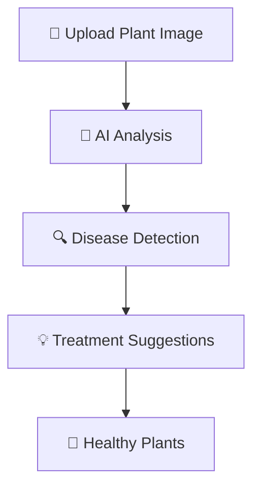

# 🌟 Hey there! I'm Bhuwan Singh 👋

```ascii
██████╗ ██╗  ██╗██╗   ██╗██╗    ██╗ █████╗ ███╗   ██╗
██╔══██╗██║  ██║██║   ██║██║    ██║██╔══██╗████╗  ██║
██████╔╝███████║██║   ██║██║ █╗ ██║███████║██╔██╗ ██║
██╔══██╗██╔══██║██║   ██║██║███╗██║██╔══██║██║╚██╗██║
██████╔╝██║  ██║╚██████╔╝╚███╔███╔╝██║  ██║██║ ╚████║
╚═════╝ ╚═╝  ╚═╝ ╚═════╝  ╚══╝╚══╝ ╚═╝  ╚═╝╚═╝  ╚═══╝
```

<div align="center">

### 🚀 Computer Science Student at BCU | 💡 Tech Innovator | 🌱 AI Enthusiast

**_"Building tomorrow's solutions with today's technology"_**

[](https://git.io/typing-svg)

</div>

---

## 🎯 About Me

<table>
<tr>
<td width="50%">

### 🌈 What Drives Me
```yaml
name: Bhuwan Singh
role: Computer Science Student
location: BCU
passion: Leveraging technology for impact
philosophy: "Smart tech should be meaningful"
```

</td>
<td width="50%">

### 🎨 Current Focus
- ✨ **Building** cutting-edge software solutions
- 📚 **Exploring** AI and seamless frontend development
- 🎯 **Goal:** Harness AI to solve real-world problems
- 🎲 **Belief:** Technology should be smart AND meaningful

</td>
</tr>
</table>

---

## 🛠️ Tech Arsenal

<div align="center">

### 💻 Languages & Frameworks


### 🔧 Tools & Technologies


### 🎯 Specialized In


</div>

---

## 🚀 Featured Projects

<div align="center">

### 🌟 Project Showcase

<table>
<tr>
<td width="50%" align="center">

### 🌿 AgriDoctor
**AI-Powered Plant Disease Detection**


```mermaid
graph TD
    A[📱 Upload Plant Image] --> B[🧠 AI Analysis]
    B --> C[🔍 Disease Detection]
    C --> D[💡 Treatment Suggestions]
    D --> E[🌱 Healthy Plants]
```

[](https://agridoctor.streamlit.app/)


</td>
<td width="50%" align="center">

### 💼 Business Solutions
**Innovative Software Development**

```ascii
    🚀 Innovation
        |
    💡 Ideas
        |
    ⚡ Development
        |
    🌟 Solutions
```


</td>
</tr>
</table>

</div>

---

## 📊 GitHub Analytics

<div align="center">


### 🔥 Contribution Streak
[](https://git.io/streak-stats)

### 🏆 GitHub Achievements
[](https://github.com/ryo-ma/github-profile-trophy)

</div>

---

## 🌐 Let's Connect!

<div align="center">

### 🤝 Find Me Around the Web

<table>
<tr>
<td align="center" width="25%">

[](https://github.com/BHUWON12)

**🐙 Code Repository**

</td>
<td align="center" width="25%">

[](https://www.linkedin.com/in/bhuwansingh02/)

**💼 Professional Network**

</td>
<td align="center" width="25%">

[](https://x.com/bhuwansinghh)

**🐦 Thoughts & Updates**

</td>
<td align="center" width="25%">

[](https://digitalbhuwan.vercel.app/)

**🌐 My Digital Space**

</td>
</tr>
</table>

</div>

---

## 🎨 Fun Zone

<div align="center">

### 🎭 Random Dev Quote


### 🐍 Contribution Graph


### 📈 Profile Views


</div>

---

<div align="center">

## 🌟 **Let's innovate, collaborate, and create something extraordinary!** 🌟

```ascii
╔═══════════════════════════════════════╗
║  🚀 Ready to build the future?        ║
║  💡 Let's turn ideas into reality!    ║
║  🌟 Together, we can make magic! ✨   ║
╚═══════════════════════════════════════╝
```

### 🎯 Always open to interesting conversations and collaboration opportunities!

[](mailto:your.email@example.com)
[](#)

</div>

---

<div align="center">
<i>⭐ From [BHUWON12](https://github.com/BHUWON12) - Made with ❤️ and lots of ☕</i>
</div>
